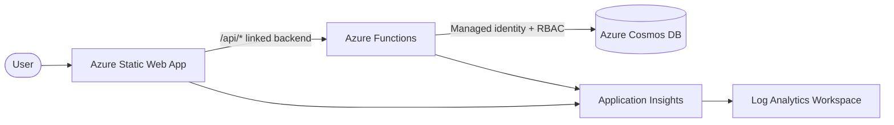

# Azure Static Web Apps starter kit

A reference [`azd`](https://aka.ms/azd) template for [Azure Static Web Apps](https://learn.microsoft.com/azure/static-web-apps/) with an [Azure Functions](https://learn.microsoft.com/azure/azure-functions/) backend, [Cosmos DB](https://learn.microsoft.com/azure/cosmos-db/) and zero secrets. Provision and deploy with one command:

```bash
azd init -t Digvijay/aswa-starter-kit
cd aswa-starter-kit
azd up
```

The infrastructure is defined entirely with [Azure Verified Modules](https://aka.ms/avm). Three backend runtimes — **Node.js 20, Python 3.11, .NET 10 isolated** — are included; one is provisioned per environment. The companion slide deck is published with the Static Web App at `/slides`.

## What you get

| Component | Implementation |
| --- | --- |
| Frontend | Azure Static Web Apps (Standard SKU) |
| Backend | Azure Functions on a Flex Consumption (FC1) plan, one of Node 20 / Python 3.11 / .NET 10 isolated |
| Database | Azure Cosmos DB for NoSQL (Serverless), local auth disabled |
| Identity | User-assigned managed identity (required by Flex Consumption for the deployment-package container) |
| RBAC | Cosmos DB Built-in Data Contributor, Storage Blob/Queue/Table data roles, and Monitoring Metrics Publisher assigned in Bicep |
| Telemetry | Application Insights + Log Analytics workspace |
| IaC | 100% AVM modules under `br/public:avm/...` |
| CI/CD | GitHub Actions with OIDC federation (`azd pipeline config`) |

## Architecture



The browser calls the Static Web App. Requests under `/api/*` are forwarded to the linked Function App. The Function App authenticates to Cosmos DB through `DefaultAzureCredential`, which resolves to its user-assigned managed identity at runtime and to your `az login` context locally.

## Project structure

```text
aswa-starter-kit/
├── .devcontainer/                # Node, Python, .NET, azd, SWA CLI, Functions Core Tools
├── .github/workflows/            # azure-dev.yml (OIDC deploy)
├── infra/
│   ├── main.bicep                # AVM orchestrator
│   ├── main.parameters.json
│   └── app/
│       ├── db.bicep              # Cosmos DB (Serverless) via AVM
│       └── db-rbac.bicep         # Cosmos data-plane SQL role
├── scripts/
│   ├── build-api.{sh,ps1}        # Stages the chosen backend into src/api/
│   └── deploy-api.{sh,ps1}       # postdeploy hook: builds + uploads the Function App
├── src/
│   ├── web/                      # Static frontend (HTML/CSS/JS)
│   │   └── slides/               # Reveal.js deck served at /slides
│   ├── api-node/                 # Node 20 isolated Functions      (reference source)
│   ├── api-python/               # Python 3.11 v2 programming model (reference source)
│   ├── api-dotnet/               # .NET 10 isolated worker          (reference source)
│   └── api/                      # Build artifact (gitignored — produced by build-api)
├── azure.yaml
└── README.md
```

## Prerequisites

- An Azure subscription with Contributor + User Access Administrator on the target resource group (or Owner). User Access Administrator is required because the template assigns RBAC roles.
- [Azure Developer CLI](https://aka.ms/azd) 1.10 or later **and** the [Azure CLI](https://learn.microsoft.com/cli/azure/install-azure-cli). The `postdeploy` hook calls `az functionapp deployment source config-zip`, so `az` is required for every runtime — not just .NET.
- You're signed in: `az login` and `azd auth login`.
- Either Docker (for the Dev Container — multi-arch, builds on linux/amd64 and linux/arm64) or local installs of Node 20, Python 3.11, the [.NET 10 SDK](https://dotnet.microsoft.com/download), the [Azure Functions Core Tools](https://learn.microsoft.com/azure/azure-functions/functions-run-local) and the [Static Web Apps CLI](https://github.com/Azure/static-web-apps-cli).
- Tenant policy permits creating user-assigned managed identities and assigning RBAC roles. If your tenant blocks self-service Entra app creation, `azd pipeline config` will fail later — see [Troubleshooting](#troubleshooting).
- Static Web Apps is only available in `westus2`, `centralus`, `eastus2`, `westeurope`, `eastasia`. Other resources can live anywhere; the SWA region is decoupled via `STATIC_WEB_APP_LOCATION` (default `westeurope`).

## Deploy

```bash
azd init -t Digvijay/aswa-starter-kit
cd aswa-starter-kit

# Optional — defaults to node
azd env set BACKEND_LANGUAGE python    # or: dotnet

azd up
```

Verified end-to-end on all three runtimes (Node, Python, .NET 10). `azd up`:

1. Validates `BACKEND_LANGUAGE` (`preprovision` hook).
2. Provisions Log Analytics, Application Insights, Storage, Cosmos DB, the Function App and the Static Web App via Bicep + AVM.
3. Builds the chosen backend into `./src/api/` and uploads it to the Function App’s deployment-package container (`postdeploy` hook → [`scripts/deploy-api.sh`](./scripts/deploy-api.sh) / `.ps1`).
4. Deploys the static frontend (the only `azd` service in `azure.yaml`).

Web URL is printed at the end. Hit `/api/status` to confirm the function is running and Cosmos is reachable through managed identity.

Want separate environments for separate runtimes? Just create more:

```bash
azd env new aswa-py  --location swedencentral && azd env set BACKEND_LANGUAGE python && azd up
azd env new aswa-net --location swedencentral && azd env set BACKEND_LANGUAGE dotnet && azd up
```

Each environment lives in its own resource group (`rg-<env-name>`).

## Identity and secrets

The deployed application uses no secrets:

- A **user-assigned managed identity** (UAMI) is created up front. Flex Consumption needs identity access to its deployment-package container at startup, so a system-assigned identity would create a chicken-and-egg problem.
- Cosmos DB has `disableLocalAuth: true`. The only way in is Entra ID.
- The UAMI is granted the **Cosmos DB Built-in Data Contributor** SQL role on the Cosmos account.
- The UAMI is granted **Storage Blob Data Owner / Queue Data Contributor / Table Data Contributor** on the AzureWebJobsStorage account so the host can use identity-based connections.
- The UAMI is granted **Monitoring Metrics Publisher** on the Application Insights component so telemetry uses AAD auth.
- App settings contain the Cosmos endpoint, database and container names — never a key.

The application code uses `DefaultAzureCredential` in all three runtimes, so the same code works locally (with `az login`) and in Azure (with the managed identity). `AZURE_CLIENT_ID` is set on the Function App so `DefaultAzureCredential` picks the right UAMI when several are attached.

## Polyglot toggle

| `BACKEND_LANGUAGE` | Reference source | What `build-api` produces |
| --- | --- | --- |
| `node` (default) | [`src/api-node`](./src/api-node)     | source + `node_modules/` (production deps) |
| `python`         | [`src/api-python`](./src/api-python) | source + `.python_packages/lib/site-packages/` (linux/x86_64 wheels for 3.11) |
| `dotnet`         | [`src/api-dotnet`](./src/api-dotnet) | `dotnet publish -c Release` output (with `.azurefunctions/` for Flex Consumption) |

`scripts/deploy-api.{sh,ps1}` zips that folder and uploads it via
`az functionapp deployment source config-zip --build-remote false`. The same
code path works for all three runtimes — there is no language-specific deploy
logic in [`azure.yaml`](./azure.yaml).

To narrow the repo down to a single backend, delete the two unused
`src/api-*` folders — nothing else needs to change.

### Why a single `web` service in `azure.yaml`?

Earlier versions of this template declared three `api-*` services in `azure.yaml`. That broke `azd up` for the two unselected ones. We now declare only the Static Web App as an `azd` service and deploy the Function App ourselves through a `postdeploy` hook — same hook for all three runtimes, identical user experience.

It also sidesteps an `azd` 1.24.x issue where pre-built .NET isolated packages get redirected to Oryx remote build on Flex Consumption and fail with *“Couldn’t detect a version for the platform ‘dotnet’”*. The `az` CLI deploys the same zip cleanly with `--build-remote false`.

## Local development

Pick the backend you want to run locally and install its deps once:

```bash
# Node 20
cd src/api-node && npm install

# or — Python 3.11
python -m venv .venv && source .venv/bin/activate   # Windows: .venv\Scripts\Activate.ps1
pip install -r src/api-python/requirements.txt

# or — .NET 10
dotnet build src/api-dotnet/Api.Dotnet.csproj
```

Sign in so `DefaultAzureCredential` can reach the Cosmos account that `azd up` provisioned, then start the Static Web Apps emulator pointing at the matching API folder:

```bash
az login

swa start ./src/web --api-location ./src/api-node
# or:  --api-location ./src/api-python
# or:  --api-location ./src/api-dotnet
```

Open <http://localhost:4280>. The frontend will call `/api/status` exactly as it does in Azure — same code, same managed-identity flow (locally satisfied by your `az login` token).

## CI/CD

```bash
azd pipeline config
```

This creates an Entra application with a federated credential for the GitHub repository, writes the required repo variables, and uses the workflow at [`.github/workflows/azure-dev.yml`](./.github/workflows/azure-dev.yml). Pull requests automatically receive a Static Web Apps [preview environment](https://learn.microsoft.com/azure/static-web-apps/preview-environments).

## Slide deck

A Reveal.js deck lives at [`src/web/slides`](./src/web/slides) and is served by the Static Web App at `/slides` after deployment. To preview locally, use the SWA CLI command above and open `http://localhost:4280/slides/`.

The deck covers:

1. What a customer needs to build a web app on Azure (skills, access, tooling).
2. Building a Static Web App by hand — the high-level flow and the step-by-step commands.
3. An end-to-end walkthrough of this template and a comparison against the manual approach.

## Approximate cost (idle, USD/month)

Flex Consumption (FC1) is billed per GB-second and per execution with a generous monthly free grant (currently 100,000 vCPU-seconds, 400,000 GB-seconds and 1M executions per subscription). An idle starter app comfortably stays inside that grant.

| Resource | SKU | Cost |
| --- | --- | --- |
| Static Web App | Standard | ~$9 |
| Function App | Flex Consumption (FC1) | $0 idle (within free grant) |
| Cosmos DB | Serverless | $0 idle (pay per RU + storage) |
| Storage | Standard_LRS | <$0.50 |
| Log Analytics + App Insights | PerGB2018 | <$2 (low traffic) |
| **Total** | | **~$11** |

Set `STATIC_WEB_APP_SKU` to `Free` to drop to roughly $2/month. The Free SKU does not support the linked-backend feature or pull-request preview environments on private repos — the deploy will succeed but `/api/*` calls will return 404.

## Customization

- Change the backend with `azd env set BACKEND_LANGUAGE ...`.
- Pin the Static Web App to a specific region with `azd env set STATIC_WEB_APP_LOCATION westeurope` (allowed: `westus2`, `centralus`, `eastus2`, `westeurope`, `eastasia`). The default is `westeurope` so the rest of the resources can live in any region (including ones where SWA is not yet available, e.g. `swedencentral`).
- Delete unused `src/api-*` folders to slim the repo down.
- Replace `src/web` with a framework of your choice (React, Vue, Svelte, Blazor WebAssembly).
- Add VNet integration through the AVM `web/site` `virtualNetworkSubnetId` parameter.
- Add Key Vault for third-party secrets via `avm/res/key-vault/vault`.

## Troubleshooting

| Symptom | Cause / fix |
| --- | --- |
| Hook fails with "BACKEND_LANGUAGE must be one of..." | You set the env var to something other than `node`, `python`, or `dotnet`. Run `azd env set BACKEND_LANGUAGE node`. |
| `npm install` / `pip install` / `dotnet publish` errors during `azd up` | The matching toolchain is not on PATH. Open the repo in the [Dev Container](./.devcontainer/devcontainer.json) (all three are pre-installed) or install the runtime locally. |
| `/api/*` returns 404 in production | The SWA is on the Free SKU. Linked backends require Standard. Set `STATIC_WEB_APP_SKU=Standard` and re-run `azd provision`. |
| Function App fails to start with a deployment-package storage error | RBAC propagation lag. Re-run `azd up`; the UAMI role assignments occur before the Function App but may take a minute to be effective globally. |
| `403 Forbidden` from Cosmos at runtime | The data-plane SQL role assignment in [`infra/app/db-rbac.bicep`](./infra/app/db-rbac.bicep) did not complete before the Function App started. Restart the Function App from the portal. |
| Provision fails with `LocationNotAvailableForResourceType` for `Microsoft.Web/staticSites` | Your `AZURE_LOCATION` is in a region where Static Web Apps is not yet available. Either pick a different `AZURE_LOCATION`, or set `STATIC_WEB_APP_LOCATION` to one of `westus2`, `centralus`, `eastus2`, `westeurope`, `eastasia`. The default is `westeurope`. |
| `pip` tries to build wheels from source on Windows / macOS | `scripts/build-api.{sh,ps1}` already pins `--platform manylinux2014_x86_64 --python-version 3.11 --only-binary=:all:` to grab the same wheels the Linux Function host will use. If you bypassed the script, do the same when running pip yourself. |
| Local `swa start` cannot reach `/api/status` | Make sure the Functions host is running on port 7071 (`func start` inside `src/api-<lang>`) and that `swa start` was invoked with `--api-location` pointing at the same folder. |

## References

- [Azure Verified Modules](https://aka.ms/avm)
- [Static Web Apps — bring your own functions](https://learn.microsoft.com/azure/static-web-apps/functions-bring-your-own)
- [Flex Consumption plan](https://learn.microsoft.com/azure/azure-functions/flex-consumption-plan)
- [`DefaultAzureCredential`](https://learn.microsoft.com/azure/developer/intro/passwordless-overview)
- [`azd` template gallery](https://azure.github.io/awesome-azd/)

## License

MIT
